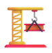

# WilhelmiCrane-esp32

An automated crane controlled by a PS4 remote controller.

The project was created for an 9th degree student project to automate a crane.

The crane can be controlled by a wired connected arduino joystick, or after connecting a PS4 controller using a bluetooth Playstation controller.

The motors support the analog controll by using PWM motor controll.

## ESP32 code

https://github.com/bjoernboeckle/WilhelmiCrane

# Setup
The crane is controlled using an ESP32 ESP32 NodeMCU, which controlls three DC motors by using two L293D motor drivers.

| **ESP32 - Pin** | **Komponente**          | **Funktion**            |
|-----------------|-------------------------|-------------------------|
| 12              | Blaue LED               | Verbindungsstatus       |
| **Drehen**                                                          |
| 23              | L293D Oben Enable 1,2   | PWM                     |
| 22              | L293D Oben Input 1      | Links                   |
| 21              | L293D Oben Input 2      | Rechts                  |
| **Hoch/Runter**                                                     |
| 5               | L293D Oben Enable 3,4   | PWM                     |
| 18              | L293D Oben Input 3      | Runter                  |
| 19              | L293D Oben Input 4      | Hoch                    |
| **Laufkatze**                                                       |
| 2               | L293D Unten Enable 1,2  | PWM                     |
| 4               | L293D Unten Input 1     | Vor                     |
| 0               | L293D Unten Input 2     | Zurück                  |
| **Joystick**                                                        |
| 39              | Joystick x              | Drehen                  |
| 34              | Joystick y              | Laufkatze               |
| 32              | Joystick switch         | Hoch/Runter             |